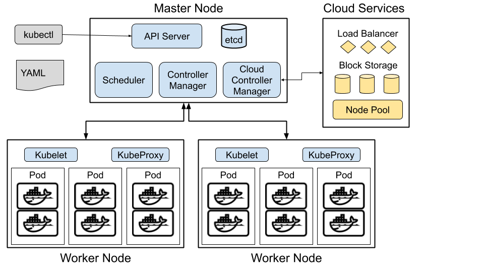

# Introduction to Kubernetes

## What is Kubernetes

Kubernetes is an open-source platform for managing containerized workloads and services at scale.

## The Architecture

A Kubernetes cluster contains a master node and a bunch of worker nodes. It is also possible to have more than one master in advanced setups.

